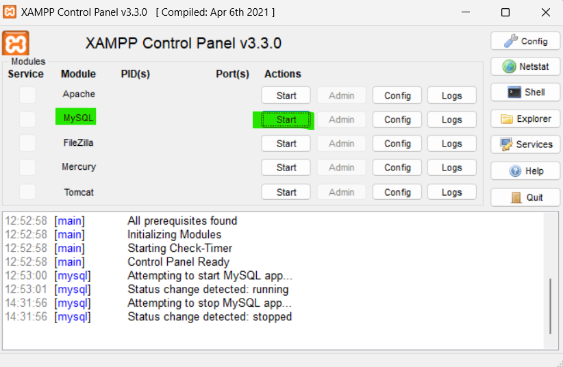
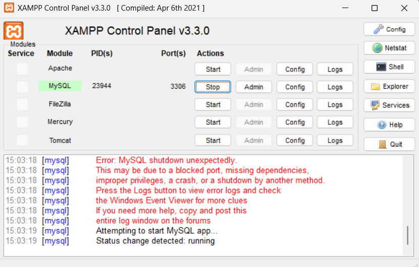
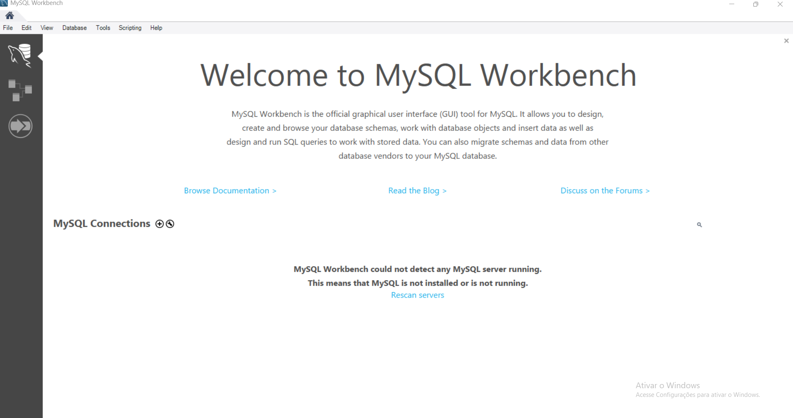
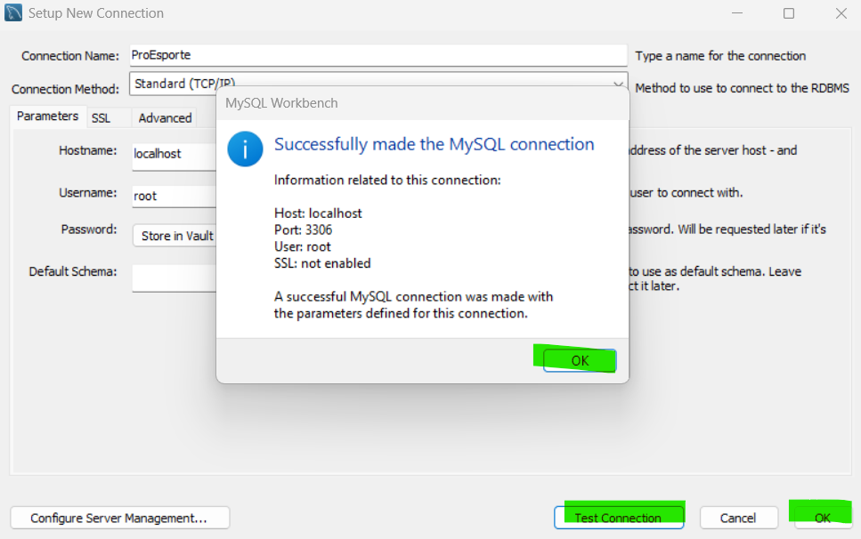
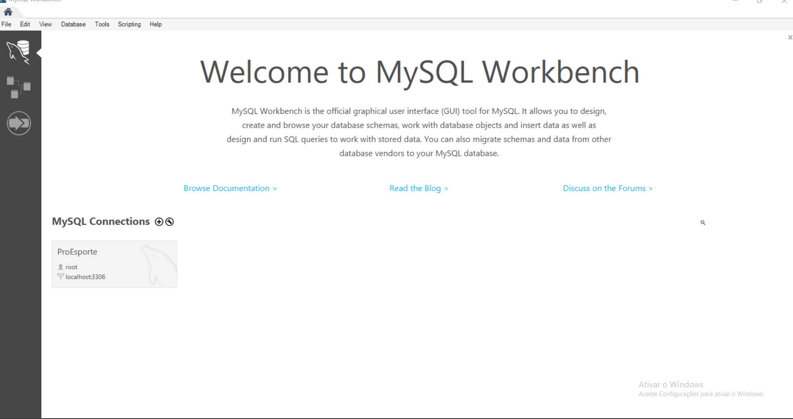

# ​​Olá​​, seja bem vindo​🤩​!! neste tutorial vou explicar como configurar o banco de dados, mas pra isso você precisa instalar o **_XAMPP_** e o **_MySQL WORKBENCH_**.

### Para realizar a instalação do **_XAMPP_** siga passo a passo do vídeos abaixo.

[Tutorial **_XAMPP_**](https://www.youtube.com/watch?v=i_ypCik4VX0)

### Para realizar a instalação do **_MySQL WORKBENCH_** siga passo a passo do vídeos abaixo.

[Tutorial **_MySQL WORKBENCH_**](https://www.youtube.com/watch?v=oi3UHWXLxLs)

### Agora que o XAMPP está instalado, abra o programa e ative o MySQL clicando em Start

dando Start o Xampp, vai liga a porta padrão 3306 e a gente irar criar a conexão no mysql.😉​

### Agora vamos para o MySQL WORKBENCH, mesmo processo abra ele na sua janela de trabalho, mas **_Atenção para o SQL funcionar o xampp precissa está funcionando ok? kkk_** abrindo o sql a primeira aba irar fica desta forma.

ai você irar clicar no "+" na parte do MysqlConections.

logo em seguida, você irar preencher os campos da mesma forma que está no foto acima.

- Connection Name : ProEsporte
- Connction Method : Standard(TCP/IP)
- Hostname :localhost
- Username: root
- Port:3306
- Obs: Pasword: pode não precisa mecher, o banco de dados não tem senha.

Depois irar clicar em testa conexão

logo em seguida, irar clicar em ok e ok de novo para criar o banco de dados.

### BANCO CRIADO !!! 🤩

Agora só clica em no banco que irar aparecer aba dele.

Após isso, clique em File -> Open SQL Script -> selecione o arquivo do banco de dados BD_ProEsporte.sql

Então clique no ícone do primeiro raio que aparece.

### Parte de banco de dados finalizada, com sucesso🤩 !!!
