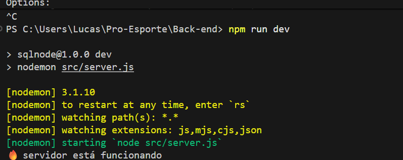

## 📘 Tutorial – Configurando o Back-end

- 1.  Acesse a pasta do Back-end

No terminal, entre na pasta do projeto:

```bash
cd .\Back-end\
```

### 1. Instale as dependências do projeto

Para quem usa Yarn, execute:

```bash
yarn add express mysql2
```

Para quem usa npm, execute:

```bash
npm add express mysql2
```

Isso instala o Express e o driver do MySQL (mysql2).

### 3. Instale todas as dependências listadas no package.json

Caso ainda não tenha o node_modules, rode:

```bash
yarn install
```

Caso ainda não tenha o node_modules, rode (para quem está usando npm e não o yarn):

```bash
npm install
```

Se você receber a mensagem:

```bash
1 high severity vulnerability
```

no meio do retorno do comando, execute o comando recomendado pelo node:

```bash
npm audit fix
```

### 4. Entendendo o que é um módulo

Um módulo é um arquivo JavaScript que contém código reutilizável.
Ele pode exportar funções, classes ou objetos para serem usados em outros arquivos.

### 5. Criar as tabelas no banco de dados

Depois de configurar o Sequelize e criar suas migrations, execute:

```bash
npx sequelize db:migrate
```

Isso cria as tabelas automaticamente no MySQL.

### 6. Rodar o servidor

Por fim, execute o sistema com:

```bash
npm run dev
```

inicia o servidor do seu projeto em modo de desenvolvimento


