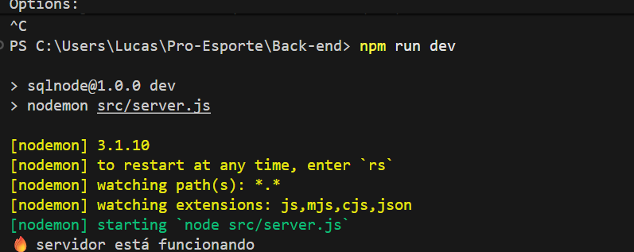

# 🟩 3. Tutorial – Configurando o Back-end
 - 1. Acesse a pasta do Back-end

No terminal, entre na pasta do projeto:
```bash
cd .\Back-end\
```
 ### 1. Instale as dependências do projeto

Como você usa Yarn, execute:
```bash
yarn add express mysql2
```

Isso instala o Express e o driver do MySQL (mysql2).

 ### 3. Instale todas as dependências listadas no package.json

Caso ainda não tenha o node_modules, rode:
```bash
yarn install
```

(Se estivesse usando npm, seria npm install.)

 ### 4. Entendendo o que é um módulo

Um módulo é um arquivo JavaScript que contém código reutilizável.
Ele pode exportar funções, classes ou objetos para serem usados em outros arquivos.

 ### 5. Criar as tabelas no banco de dados

Depois de configurar o Sequelize e criar suas migrations, execute:
```bash
npx sequelize db:migrate
```
Isso cria as tabelas automaticamente no MySQL.

 ### 6. Rodar o servidor

Por fim, execute o sistema com:
```bash
npm run dev
```
inicia o servidor do seu projeto em modo de desenvolvimento


